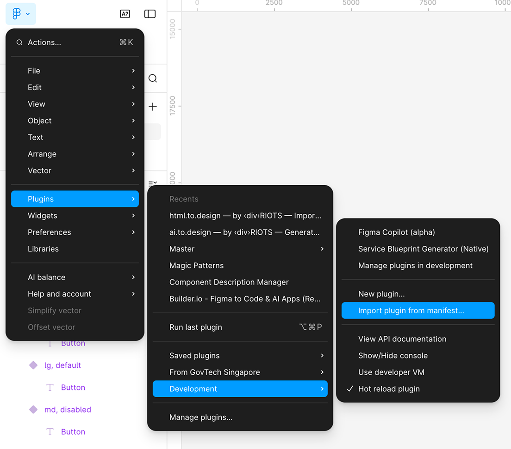
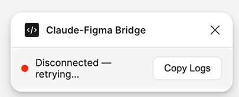
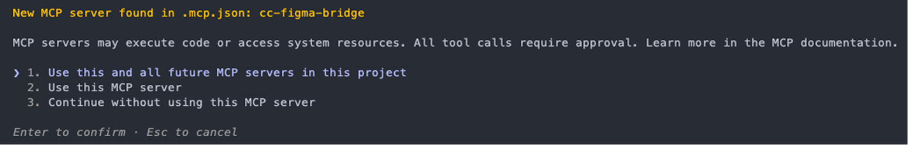
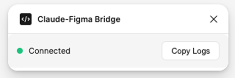
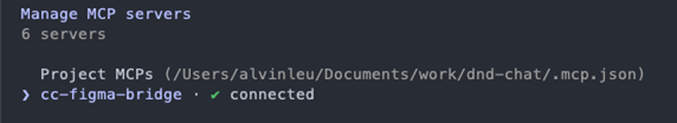

# Claude-Figma Bridge

Let Claude read and modify your Figma files through an MCP server. A lightweight Figma plugin connects to a local Node.js server — Claude handles the intelligence, the plugin is just a bridge.

In limited testing, it works with Figma Design, FigJam, and Figma Slides.

## How This Came About

I wanted a way to create and edit Figma designs through natural language. I started with [Figma Copilot](https://github.com/witxhhaven/fig-design-assistant), but it relies on API tokens. I wanted something that uses my existing Claude subscription instead — so I vibe coded this.

It actually works better than the copilot version: you drop the MCP config into your project repo, so Claude has access to both your Figma file and your codebase at the same time. It can also fix errors automatically since it runs in the Claude Code loop.

## What You Need

- [Node.js](https://nodejs.org/) v18+
- [Figma](https://www.figma.com/downloads/) desktop app
- **Claude Code** (CLI)

## Setup

### 1. Install, Build, and Link

```bash
git clone https://github.com/witxhhaven/figma-mcp.git
cd figma-mcp
npm install
npm run build          # compile the MCP server
npm run build:plugin   # bundle the Figma plugin
npm link               # make `figma-mcp` available globally
```

`npm link` creates a global `figma-mcp` command so other repos can use the server without knowing the path to this repo. You only need to do this once (and again after a fresh `npm run build` if you pull changes).

> **Note:** You do **not** need to manually start the MCP server. Claude Code launches it automatically when it connects. Just make sure the Figma plugin is running.

### 2. Load the Plugin in Figma

1. Open the Figma desktop app and open any file
2. Go to **Plugins → Development → Import plugin from manifest...**
3. Select `figma-mcp/plugin/manifest.json`



4. Run it: **Plugins → Development → Claude-Figma Bridge**
5. A small status window appears with a **red dot** (not connected yet)



> You only need to import once. After that, just re-run the plugin from the Development menu whenever you open Figma.

### 3. Connect to Claude Code

Copy the `.mcp.json` from the `mcp-config/` folder into the root of the project you want to work in.

**Via terminal:**

```bash
cp /path/to/figma-mcp/mcp-config/.mcp.json /path/to/your-project/
```

**Manually:** `.mcp.json` is a hidden file — run `open .` inside the `mcp-config/` folder of this repo to reveal it in Finder (or press `Cmd + Shift + .` to toggle hidden files), then copy it to your project root.

Once copied, open Claude Code from that project directory — it will detect the MCP server and prompt you to confirm:



Select option 1 to enable the server for this project.

#### Adding globally

If you want the Figma tools available in every Claude Code session without copying `.mcp.json` into each project:

```bash
claude mcp add cc-figma-bridge -s user -- figma-mcp
```

<!-- #### Claude Desktop (not yet supported)

Add to your config file (`~/Library/Application Support/Claude/claude_desktop_config.json` on macOS, `%APPDATA%\Claude\claude_desktop_config.json` on Windows):

```json
{
  "mcpServers": {
    "cc-figma-bridge": {
      "command": "figma-mcp"
    }
  }
}
```

**Fully quit** Claude Desktop (Cmd+Q / Alt+F4) and reopen it. You should see an MCP tools icon in the chat input. -->

### 4. Verify It Works

If everything is connected, you'll see a **green dot** in the Figma plugin:



And in Claude Code, run `/mcp` to confirm `cc-figma-bridge` shows as connected:



### 5. Start Using It

Ask Claude anything about your Figma file:

- *"What's on my current Figma page?"*
- *"Extract the color tokens from my codebase and create matching Figma variables"*
- *"Create hover, focus, and disabled states for this button component"*
- *"Apply the blue color variables defined in Figma to this component"*
- *"Sync the spacing and typography tokens from our Tailwind config into Figma variables"*
- *"Generate all the size variants (sm, md, lg) for the selected input component"*
- *"Create a card component with a title, description, and button"*
- and more

## Tools

| Tool | What it does |
|---|---|
| `get_scene` | Full scene dump — selected nodes, their properties, variables, text styles, page info |
| `get_selection` | Quick summary of selected nodes (IDs, names, types) |
| `execute_code` | Runs Figma Plugin API code in the sandbox (create nodes, modify properties, etc.) |
| `export_image` | Exports a node as PNG (by node ID or current selection) |
| `connection_status` | Checks if the Figma plugin is connected |


## Uninstall

```bash
npm unlink -g figma-mcp
```

If you added the MCP server globally, remove it:

```bash
claude mcp remove cc-figma-bridge -s user
```

If you copied `.mcp.json` into any project directories, delete those files too.

## Troubleshooting

**Plugin shows red dot (not connected)**
- Make sure the Figma plugin is running and Claude Code is open
- Check port 3002 isn't in use: `lsof -i :3002`
- The plugin auto-reconnects every 3 seconds — wait a moment after starting the server

**Claude doesn't show Figma tools**
- Make sure you're in a directory with `.mcp.json`, or you've added it globally

**"Font not loaded" errors**
- `execute_code` auto-retries with font loading up to 3 times
- If it still fails, load fonts explicitly:
  ```javascript
  await figma.loadFontAsync({ family: "Inter", style: "Regular" });
  textNode.characters = "Hello";
  ```

**Port 3002 already in use**
- Find what's using the port: `lsof -i :3002`
- Kill it: `kill $(lsof -t -i :3002)`
- Or just ask Claude Code: *"kill whatever is running on port 3002"*

**Plugin disappears after restarting Figma**
- Re-run it from **Plugins → Development → Claude-Figma Bridge** (the import persists, you just need to launch it each session)
